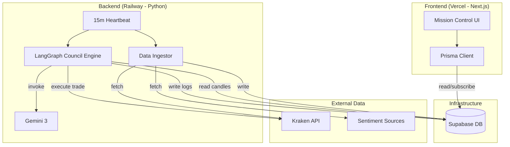

### **Document Output: Fullstack Architecture Document**

```markdown
# ContrarianAI Fullstack Architecture Document

**Version:** 1.0
**Date:** 2025-12-31
**Status:** Approved

## 1. Introduction
This document outlines the complete fullstack architecture for **ContrarianAI**, an automated crypto investment system. It integrates a **Next.js 15** frontend for "Mission Control" visualization with a robust **Python (LangGraph)** backend for AI-driven trading logic.

The system is designed as a **Monorepo** to ensure type safety and consistent schema management using **Prisma 7**.

### 1.1 Change Log
| Date | Version | Description | Author |
| :--- | :--- | :--- | :--- |
| 2025-12-31 | 1.0 | Initial Architecture Design | Winston (Architect) |

## 2. High Level Architecture

### 2.1 Technical Summary
ContrarianAI employs a **Decoupled Worker Architecture**. The core logic is not a standard API, but a persistent **Python/LangGraph Worker** running on a 15-minute heartbeat to ingest data, deliberate via a "Council of Agents," and execute trades. The Frontend is a **Next.js** application that reads real-time status and logs directly from the shared **Supabase** database. We use **Prisma 7** as the single source of truth for the database schema, with **SQLModel** providing Python-native access to those same tables.

### 2.2 Platform Infrastructure
*   **Frontend:** **Vercel** (Next.js App Router).
*   **Backend Worker:** **Railway** (Python FastAPI/Daemon). Selected for persistent execution capabilities.
*   **Database:** **Supabase** (PostgreSQL).
*   **AI Engine:** **Google Gemini 3** (via Vertex AI).

### 2.3 Architecture Diagram



## 3. Tech Stack

This table defines the mandatory technology versions for development.

| Category | Technology | Version | Purpose | Rationale |
| :--- | :--- | :--- | :--- | :--- |
| **Frontend Language** | TypeScript | 5.3+ | Web Dashboard | Type safety across the full stack. |
| **Frontend Framework** | Next.js | 15.0+ | UI Framework | Latest App Router features, Vercel optimization. |
| **Backend Language** | Python | 3.11+ | Trading Engine | Native support for LangGraph and Data Science libraries. |
| **Backend Framework** | FastAPI | 0.109+ | Python API/Worker | High-performance async support for AI workflows. |
| **Agent Framework** | **LangGraph** | 0.0.10+ | AI Orchestration | Best-in-class for stateful, cyclic multi-agent flows. |
| **Database ORM (JS)** | **Prisma** | **7.x** | Schema/Web Data | Latest version with serverless driver adapters. |
| **Database ORM (Py)** | **SQLModel** | 0.0.14+ | Bot Data Access | Pydantic/SQLAlchemy hybrid; perfect for FastAPI/AI. |
| **Package Manager** | **pnpm** | 8.x | Monorepo Mgmt | Efficient disk usage, fast installation for workspaces. |
| **UI Library** | Shadcn UI | Latest | Components | Accessible, copy-paste component architecture. |
| **Charts** | Recharts | Latest | Visualization | React-native charting for price/sentiment data. |

## 4. Data Models (Prisma Schema)

The database schema is defined in `schema.prisma`. This acts as the contract between the Python Bot and the Next.js Frontend.

### 4.1 Core Entities

**`Asset`**
*   **Purpose:** Registry of tradable coins.
*   **Fields:** `id`, `symbol` (e.g., "SOLUSD"), `isActive` (bool), `lastPrice` (decimal).

**`Candle`**
*   **Purpose:** Historical price data for Technical Analysis.
*   **Fields:** `id`, `assetId`, `timestamp`, `open`, `high`, `low`, `close`, `volume`.
*   **Indexes:** Compound index on `[assetId, timestamp]` for fast lookup.

**`CouncilSession`** (Critical for UI)
*   **Purpose:** Stores the "Debate" logic for every decision cycle.
*   **Fields:**
    *   `id`, `assetId`, `timestamp`
    *   `sentimentScore` (Int 0-100)
    *   `technicalSignal` (String: BUY/SELL/NEUTRAL)
    *   `visionAnalysis` (Text: Pattern description)
    *   `finalDecision` (Enum: BUY/HOLD/SELL)
    *   `reasoningLog` (Text: Full AI synthesis explanation)

**`Trade`**
*   **Purpose:** Tracks active and past positions.
*   **Fields:**
    *   `id`, `assetId`, `status` (OPEN/CLOSED)
    *   `entryPrice`, `size`, `entryTime`
    *   `stopLossPrice` (Dynamic - updated by bot)
    *   `takeProfitPrice` (Dynamic)
    *   `exitPrice`, `exitTime`, `pnl` (Profit/Loss)

## 5. Repository Structure

We utilize a **Turborepo** structure to manage the full stack.

```text
contrarian-ai/
├── apps/
│   ├── web/                    # Next.js 15 Dashboard
│   │   ├── app/                # App Router
│   │   ├── components/         # Shadcn UI Components
│   │   └── lib/prisma.ts       # Prisma Client Instance
│   └── bot/                    # Python Trading Engine
│       ├── core/               # LangGraph Definitions
│       ├── services/           # Kraken/LunarCrush Services
│       ├── database.py         # SQLModel connection
│       └── main.py             # Scheduler Entry Point
├── packages/
│   ├── database/               # Shared Prisma Schema
│   │   ├── prisma/schema.prisma
│   │   └── index.ts            # Generated Client exports
│   └── types/                  # Shared TypeScript Interfaces
├── turbo.json                  # Turborepo Config
├── package.json                # Root (pnpm workspaces)
└── docker-compose.yml          # Local DB for dev
```

## 6. Component Architecture

### 6.1 Backend Components (Python)
*   **Ingestion Service:** Asynchronous poller for Kraken/Socials. Uses `httpx` for non-blocking API calls.
*   **Council Engine (LangGraph):**
    *   *State Graph:* Defines the flow: `Start -> Sentiment -> Technical -> Vision -> Master -> End`.
    *   *Nodes:* Each agent is a functional node that mutates the shared `GraphState`.
*   **Execution Service:** Wrapper around Kraken Private API. Handles order placement and error retries.

### 6.2 Frontend Components (Next.js)
*   **CouncilFeed:** A specialized UI component that renders `CouncilSession` rows as a chat interface, parsing the `reasoningLog` for display.
*   **TradeCard:** Visualizes active trades with a live progress bar showing current price relative to Entry and Stop Loss.
*   **ScannerGrid:** A data-grid (TanStack Table) showing the Top 30 assets, sortable by "Fear Score" or "Technical Strength."

## 7. Development Workflow

**Local Setup:**
1.  `pnpm install`: Installs Node dependencies.
2.  `docker-compose up`: Starts local Postgres (Supabase emulation).
3.  `pnpm db:push`: Pushes Prisma 7 schema to local DB.
4.  `pnpm dev`: Starts Next.js (port 3000) and Python Bot (port 8000/Worker).

**Deployment:**
*   **Frontend:** Push to `main` triggers Vercel deployment.
*   **Backend:** Push to `main` triggers Railway deployment (via Dockerfile in `apps/bot`).
*   **Database:** Prisma migrations run via GitHub Actions on deploy.
```

---

**Architecture Completed.**

You now have a production-grade blueprint.
1.  **Project Brief** (The Vision)
2.  **PRD** (The Logic)
3.  **Architecture** (The Structure)

**Current Status:** All planning artifacts are validated and ready in the `docs/` folder.

**Recommended Next Step:**
Switch to the **Scrum Master (SM)** to create the first User Story. This will likely be **"Setup Monorepo & Infrastructure,"** kicking off the development phase.

Type `*agent sm` to begin building.